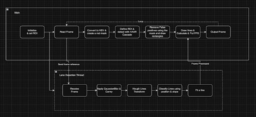

# ADAS

## Lane and Stop Sign Detection

The project offers a C++ implementation that detects lanes and stop signs in video footage using OpenCV, along with a custom channel implementation for communication between threads.

## Features

- **Lane Detection**: Detects and highlights lanes using the Hough Line Transform.
- **Stop Sign Detection**: Detects stop signs using a pre-trained Haar Cascade Classifier.
- **Multithreading**: Custom implementation of `Channel` and `BufferedChannel` classes facilitate inter-thread communication for efficient parallel processing.

## Design

## Code Overview

### `channel.h`

Defines `Channel` and `BufferedChannel` classes for thread-safe communication.

- **Channel**: A simple unbuffered channel for single-item communication.
- **BufferedChannel**: A buffered channel that can hold multiple items.

### `main.cpp`

- Loads video frames.
- Processes frames for lane and stop sign detection.
- Uses multithreading for efficient processing.

#### Functions

- **frameLoader**: Loads frames from the video and sends them through a `BufferedChannel`.
- **processStopSigns**: Detects stop signs in a given frame.
- **processLanes**: Detects lanes in a given frame and calculates the offset from the lane center.

